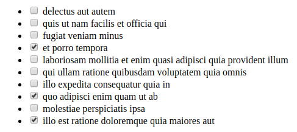

# modeljs
A quick and dirty javascript web front-end framework from a guy who knows nothing about javascript.

Hook up a javascript model class to a JSON API endpoint and declare the corresponding DOM element in pure javascript.

## Usage

See [examples](examples).

### Example code:

```javascript
Task = new Model({
    name: 'task',
    url: "https://jsonplaceholder.typicode.com/todos",
    parent: "#task-list",
    dom: {
        tag: "li",
        children: [
        {tag:'input', type:"checkbox"},
        " {{ this.data.title }}"
        ]
    },
    hooks: {
        postRender:function() {
            if( this.data.completed ) {
                this.element.find('input').attr('checked', "checked");
            }
        }
    }
});
```

### Result:


